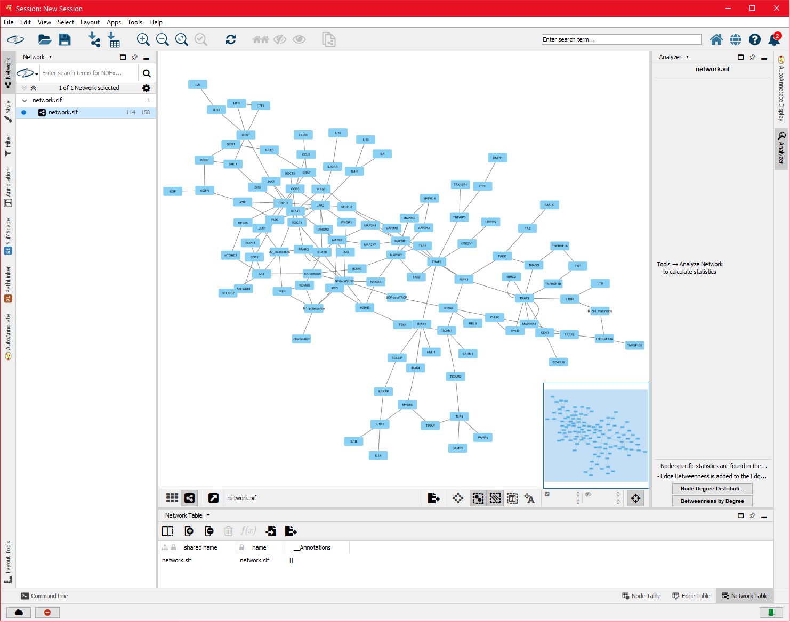
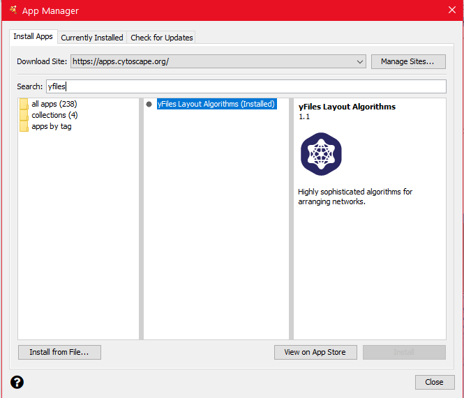
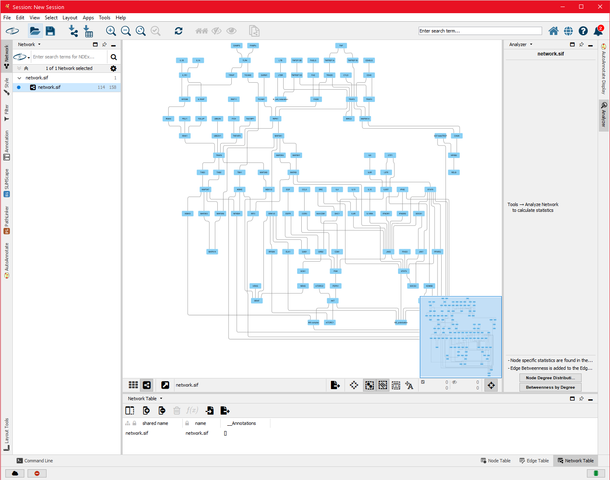
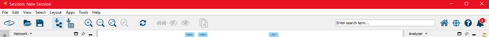
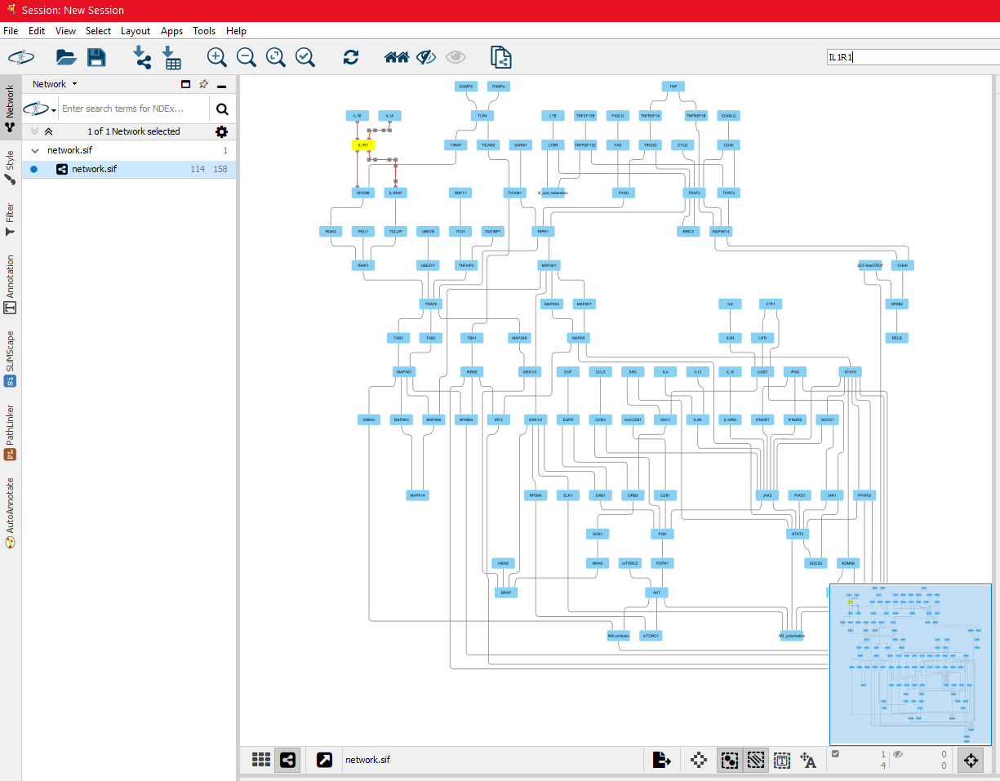
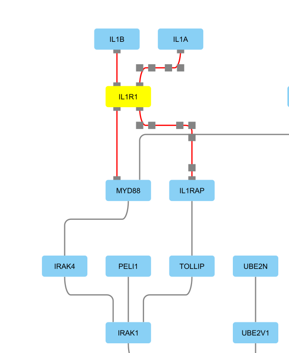
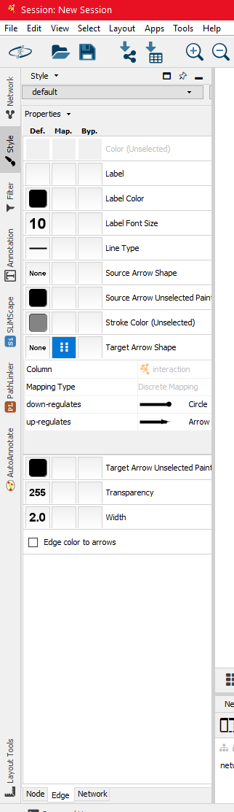
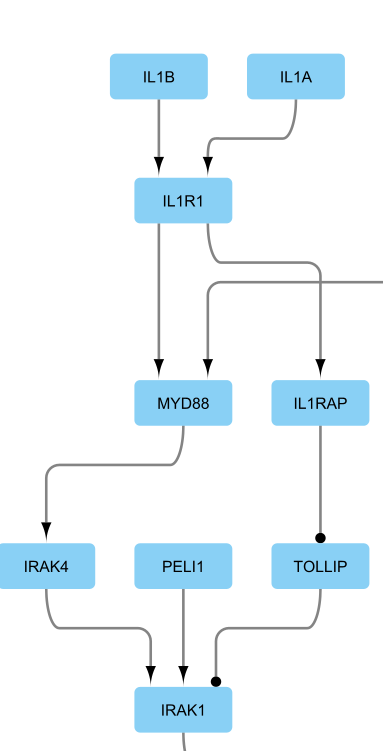

# User Guides

## How to Start
1. Download SIF file from the repository: [Click to Download](https://bitbucket.org/pkhlab/pathwayanalysis/get/e2b9464490d5.zip) 
2. Unzip the download file 
3. Locate .sif file (*expanded_IL6_modified_receptor.sif* for this tutorial)

### In Cytoscape 
- **[Main Tab]** File -> Import -> Network from File or [Ctrl + L]

- **[Main Tab]** Layout -> yFiles Hierarchic Layout (This is a plugin so you may be required to download and install as yFiles package)
    - To install yFiles Layout Algorithms: **[Main Tab]** Apps -> App Manager -> Search yfiles in the searching bar -> Install 
    

#### Exploring the network 
- **[Search Bar]** Type the target node (example: IL1R1) and press [Enter]

- The highlighted node and edges are associated with searched node

- **[Zoomed with scroll]**

### Customizing Visualization 
- **[Side Tab]** Style -> Edge -> Middle block of [*Target Arrow Shape*] -> Discrete Mapping in [*Mapping Type*]

- **[Zoomed with Scroll]**

