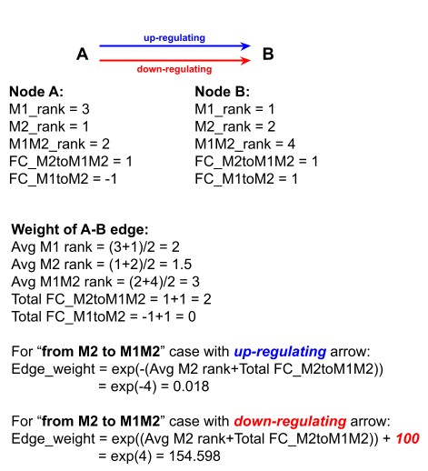

# Calculation Summary
### NetworkX-based network analysis based on the weight of edges/path evaluated by mRNA sequence data (and possibly protein expression data set)
Full script is available [**HERE**](/pages/user_guides/InPython/calculation/calculation.html) under Analysis section 

### Step 1
As introduced via [**Cytoscape**](/pages/user_guides/InCytoscape/cyto.html), the user can construct the desired network and generate sif file by exporting the completed network.  

### Step 2: exporting mRNA sequence data based on the network node name 
The python script exports the list of node names from the sif file, then construct another data tree of the mRNA sequence expression date from M1, M2, and M1M2 (M2 phenotype treated with M1 MEV). 

The following is the example for the data structure the script generates from network file (sif) and mRNA sequence file (csv)
```python
M1_data_set = {'NodeName_1': Expression_Value_from_mRNA_1,
               'NodeName_2': Expression_Value_from_mRNA_2,
               'NodeName_3': Expression_Value_from_mRNA_3,
               'NodeName_4': Expression_Value_from_mRNA_4,
               'NodeName_5': Expression_Value_from_mRNA_5,
               ...
               'NodeName_N': Expression_Value_from_mRNA_N}

```

### Step 3: ranking the node by 4 integers based on the expression level
Since the expression data provided by mRNA sequence analysis are not absolute scale, the script takes an arbitrary/abstract classification to evaluate the degree of expression by simple statistical tool, such as `percentile`. 
For instance, the node or protein with expression falling into below 10% percentile is ranked as 1. 
The rest of ranking scheme is as the following: 
```python 
if Exp_mRNA_Node <= percentile_10:
    rank = 1
elif percentile_10 < Exp_mRNA_Node <= percentile_50:
    rank = 2
elif percentile_50 < Exp_mRNA_Node <= percentile_95:
    rank = 3
elif Exp_mRNA_Node > percentile_95:
    rank = 4 
```

This process is applied to all the cases such as data from M1, M2, and M1M2. 

In the later, if node name does not appear in the mRNA sequence data, then 0 is assigned for its rank. 

### Step 4: assigning binary for fold change 
In specific example of M1 repolarization, we are targeting M2 vs. M1M2. 
Specifically, the network is M1 polarization oriented. 
Thus, it is ideal to obtain up-regulated expression from M2 to M1M2.

```python
FC = Exp_mRNA_Node_M1M2/Exp_mRNA_Node_M2
if log2(FC) > 0:
    "Up-Regulated" so it is 1 
elif log2(FC) < 0:
    "Down-Regulated" so it is -1 
```

There are four cases we are analysing in this specific calculation
1. M2 to M1M2 
2. M1M2 to M2 
3. M2 to M1 
4. M1 to M2 

1 and 2 are complementary processes so case 1 is calculated as log2(M1M2/M2) and case 2 is negated case 1. 

### Step 5: weighing edges 
This is a critical part of analysis. 



### Step 6: calculating the total cost of pathway mediated by a given receptor
There are four scores the script generate 
1. `M1_target`
2. `M2_target` 
3. `M1_control`
4. `M2_control`

- `target` means it is based on M2 and M1M2 dataset.

For instance, the score of `M1_target`, *in which M2 is being repolarized to M1M2*, is a function of two variables, M2 expression and log2(FC[M2 to M1M2]). The details of calculation is shown in the weighing edge calculation or click [**HERE**](/pages/user_guides/InPython/calculation/calculation.html). 

- `control` means it is based on M1 and M2 dataset. 

For instance, the score of `M1_control`, *in which M2 is being repolarized to M1*, is a function of two variables, M2 expression and log2(FC[M2 to M1]). Basically, replace `Total FC_M2toM1M2` with `Total FC_M2toM1` in the weighing edge calculation. 

### Step 7: final evaluation 
All pathways (due to the limitation of our model) can go either M1 or M2 polarization as the final destination but their **Scores** obtained by this script reflect their roles in inflammation. 
To maximize the difference between pro- and anti-inflammatory receptors, we divide complementary scores. 

For instance, instead of reporting or ranking the pathways based on `M1_target` itself, we divide `M1_target` by `M2_target`. 

In this specific example, we provide all the possible combinations, but `M1_target/M2_control` should demonstrate the most robust score since the `M2_control` conveys the most natural degree of receptor's association with M2 polarization. 

