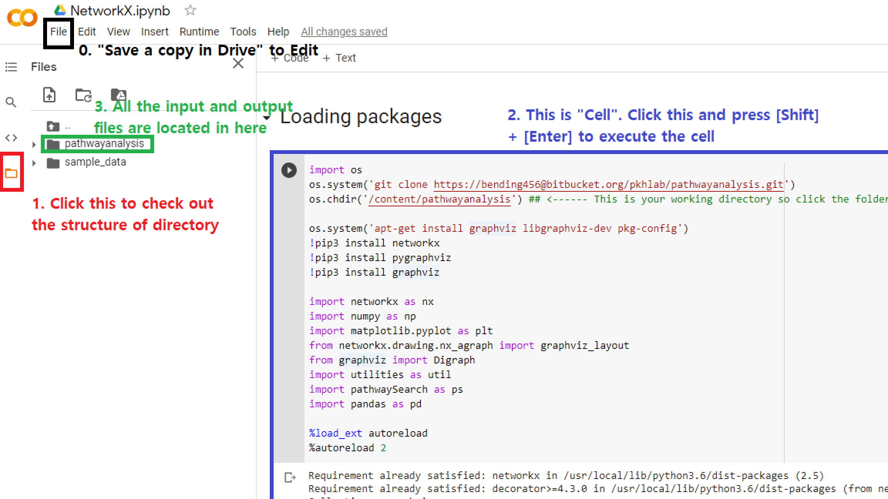
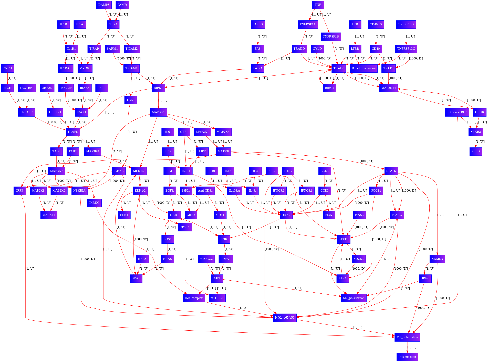
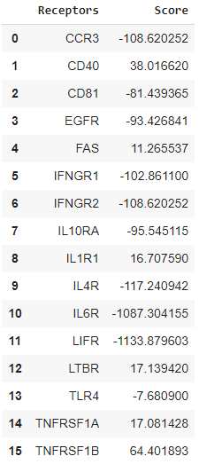

# What's in this script?

## Getting started
- [Colab version script](https://colab.research.google.com/drive/1PSOWYYL02cIj1OOGdbbzifEe-YYkp6cL?usp=sharing): 
- Make sure you copy this file into your own Google Drive
  - Click "File" in the main tap
  - Click "Save a copy in Drive"

## The 1st Cell 
- Execute the following script in ipynb or Colab script by either click the play button or press [Shift] + [Enter]

```python
import os
os.chdir('/home')
os.system('git clone https://bending456@bitbucket.org/pkhlab/pathwayanalysis.git')
os.chdir('/home/pathwayanalysis') ## <------ This is your working directory so click the folder symbol to navigate it

os.system('apt-get install graphviz libgraphviz-dev pkg-config')
!pip3 install networkx
!pip3 install pygraphviz
!pip3 install graphviz

import networkx as nx 
import numpy as np 
import matplotlib.pyplot as plt
from networkx.drawing.nx_agraph import graphviz_layout
from graphviz import Digraph
import utilities as util

%load_ext autoreload
%autoreload 2
```

The execution of this cell will do the followings:
### Part 1: Locate yourself
- The Folder icon in the far left in the main page takes you to the file structure view on the left. 
  - The default location of current working directory is 
```
/content
```
  - Where the script is being executed is 
```
/content/pathwayanalysis
```
  - Your current working directory won't change just because you open /home/pathwayanalysis in the directory tree. 
  - Please, execute the cell containing the following script
  ```python
  import os
  os.system('git clone https://bending456@bitbucket.org/pkhlab/pathwayanalysis.git')
  os.chdir('/content/pathwayanalysis')
  ```
    - The script in the line 3 will download the input data files (sif or csv files) to /home/pathwayanalysis 
    - The script in the line 4 will change your current working directory 

### Part 2: Installing the prerequisit packages for NetworkX
- In the Colab environment, it is rare to see missing packages. However, the NetworkX is not a common package.

```python 
os.system('apt-get install graphviz libgraphviz-dev pkg-config')
!pip3 install networkx
!pip3 install pygraphviz
!pip3 install graphviz
```

### Part 3: Loading packages for the analysis 
- The following script will import all the required packages for the analysis 
```python
import networkx as nx 
import numpy as np 
import matplotlib.pyplot as plt
from networkx.drawing.nx_agraph import graphviz_layout
from graphviz import Digraph
import utilities as util
```

## The 2nd Cell 
```python
#####################################################
### Extracting Gene names from mRNA sequence data ###
#####################################################
mRNA_inputfilename = 'mRNAdata'
data_mrna = util.reader(mRNA_inputfilename)

#########################################
### Extracting protein names and data ###
#########################################
Prot_inputfilename = 'Ab_Chris'
data_prot, prot_name = util.protReader(Prot_inputfilename)

########################################################################
### Extracting Node names from pathway file generated from Cytoscape ###
########################################################################
network_inputfilename = 'expanded_IL6_modified_receptor'
data_network = util.reader(network_inputfilename,sif=True) 

##############################################################################
### Sorting nodes and edges                                                ###
###           and add the weight to each edge based on its unique feature  ###
##############################################################################
node_names = np.unique(data_network['start_nodes']+data_network['end_nodes']) ## get unique node name
edge_unique_feature = np.unique(data_network['edge_features']) ## get unique edge feature

edge_weight_dict = util.weighingEdges(edge_unique_feature,1000,1)

######################################################################
###       Generating Network Image based on pathway file           ###
###  This step is simply for the better visualization than default ###
######################################################################
'''
File will be generated in /content/pathwayanalysis directory
under the name "network_figure.png"
'''
util.NetworkFigure(node_names,data_network,edge_weight_dict)

###########################################
###       Performing the analysis       ###
###########################################
destination = 'M1_polarization'
receptor_and_score = util.score_per_receptor(destination,
                                             data_mrna,
                                             prot_name,
                                             data_prot,
                                             data_network,
                                             node_names,
                                             edge_weight_dict)

import pandas as pd 
df = pd.DataFrame(receptor_and_score)
df
```

### Part 1: Extracting Gene Names from mRNA sequence data 
```python
mRNA_inputfilename = 'mRNAdata'
data_mrna = util.reader(mRNA_inputfilename)
```
- Built-in function in utilities.py should be able to pull text file format into data set for the analysis
- If a new mRNA sequence data is introduced, please correct the name of file in ***mRNA_inputfilename***

### Part 2: Extracting protein names and data
```python
Prot_inputfilename = 'Ab_Chris'
data_prot, prot_name = util.protReader(Prot_inputfilename)
```
- Built-in function in utilities.py should be able to pull text file format into data set for the analysis
- As introduced above, please correct the name of file in ***Prot_inputfilename***

### Part 3: Extracting Node names from pathway file generated from Cytoscape
```python
network_inputfilename = 'expanded_IL6_modified_receptor'
data_network = util.reader(network_inputfilename,sif=True) 
```
- Built-in function in utilities.py should be able to pull text file format into data set for the analysis
- As introduced above, please correct the name of file in ***network_inputfilename***

### Part 4: Sorting nodes and edges and add the weight to each edge based on its unique feature
```python
node_names = np.unique(data_network['start_nodes']+data_network['end_nodes']) ## get unique node name
edge_unique_feature = np.unique(data_network['edge_features']) ## get unique edge feature

edge_weight_dict = util.weighingEdges(edge_unique_feature,1000,1)
```
- This step will prepare ingradients to create a network based on the .sif file you provide. 

### Part 5: Generating Network Image based on pathway file 
```python
util.NetworkFigure(node_names,data_network,edge_weight_dict)
```
-Built-in function in utilities.py should be able to generate network figures that should be equivalent to the network figure generated by Cytoscape. However, the NetworkX-based figure will provide the type of edges and their weights in the figure. 



### Part 6: Analysis 
```python
destination = 'M1_polarization'
receptor_and_score = util.score_per_receptor(destination,
                                             data_mrna,
                                             prot_name,
                                             data_prot,
                                             data_network,
                                             node_names,
                                             edge_weight_dict)

import pandas as pd 
df = pd.DataFrame(receptor_and_score)
df
```
- At this point, we have two designated target (denoted as ***destination***)
  1. M1_polarization
  2. M2_polarization 

## Outcome

### Part 1: Pathway length and edge weight based analysis 
- From each receptor to the assigned destination (example: M1_polarization)

```python
The shortest path from  CCR3  (Upstream Receptor) to M1_polarization in a weighted Pathway Network: 
 ['CCR3', 'JAK2', 'PI3K', 'PDPK1', 'AKT', 'IKK-complex', 'NfKb-p65/p50', 'M1_polarization'] 
 with score of  7 

The shortest path from  CD40  (Upstream Receptor) to M1_polarization in a weighted Pathway Network: 
 ['CD40', 'TRAF2', 'RIPK1', 'MAP3K1', 'MAP2K4', 'MAPK8', 'IRF3', 'M1_polarization'] 
 with score of  7 
```

### Part 2: Results of comparision among three input and converted score
- ***WARNING*** Not all nodes appear in the protein expression data or mRNA sequence data. 
- This outcome will show nodes found in mRNA sequence data set ("Expression in M2" and "Fold Change from M2 to M1M2") and protein expression ("Fold Change from Protein Expression")
- Below example demonstrates that some of proteins or mRNA sequence data fully includes nodes found in Cytoscape pathway.

```python
Checking the expression of each node from mRNA seq data for  IL1R1 -mediated pathway
- Name of Node:  IL1R1
-- Expression in M2:  0.4938276053
-- Fold Change from M2 to M1M2:  3.936674711
- Name of Node:  IRAK4
-- Expression in M2:  55.04258608
-- Fold Change from M2 to M1M2:  -0.7194368119
- Name of Node:  IRAK1
-- Expression in M2:  85.88128772
-- Fold Change from M2 to M1M2:  -0.4604380523
MAP3K7
-- Fold Change from Protein Expression:  -1.1235955056179776
- Name of Node:  IKBKG
-- Expression in M2:  42.42288298
-- Fold Change from M2 to M1M2:  1.623497456
IKK-complex
-- Fold Change from Protein Expression:  -1.1904761904761905
IKK-complex
-- Fold Change from Protein Expression:  -1.1904761904761905
Nfkb-p65/p50
-- Fold Change from Protein Expression:  -0.9433962264150942
- Pathway Score:  16.707590336675466 pathway length:  10
----END----
```

### Part 3: Final score per receptor 

- The higher the better