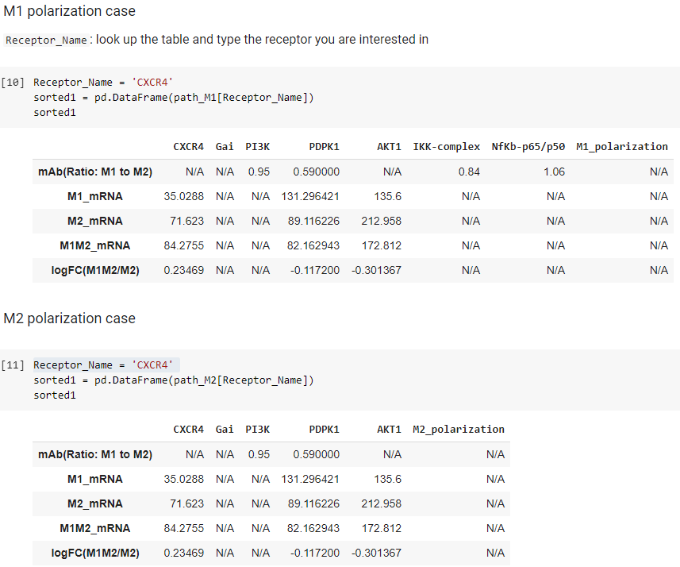
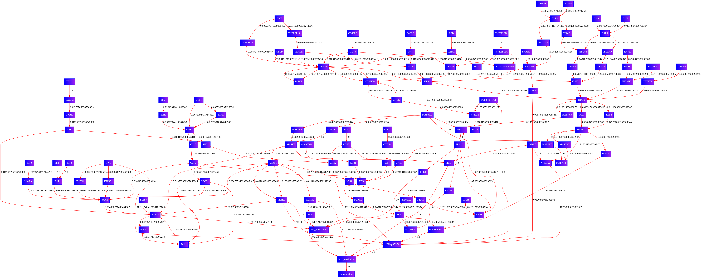

# What's in this script?

## Getting started
- [Colab version script](https://colab.research.google.com/drive/15MN-TPf8YxHK6o4suh9fW5QAwyQ7_JNq?usp=sharing): 
- Make sure you copy this file into your own Google Drive
  - Click "File" in the main tap
  - Click "Save a copy in Drive"

## Loading Packages
- Execute the following script in ipynb or Colab script by either click the play button or press [Shift] + [Enter]

```python
import os
os.system('git clone https://bending456@bitbucket.org/pkhlab/pathwayanalysis.git')
os.chdir('/content/pathwayanalysis') ## <------ This is your working directory so click the folder symbol to navigate it

os.system('apt-get install graphviz libgraphviz-dev pkg-config')
!pip3 install networkx
!pip3 install pygraphviz
!pip3 install graphviz

import networkx as nx 
import numpy as np 
import matplotlib.pyplot as plt
from networkx.drawing.nx_agraph import graphviz_layout
from graphviz import Digraph
import utilities_new as util
import pathwaySearch_new as ps
import pandas as pd 
import math

%load_ext autoreload
%autoreload 2
```

## Analysis
### User Guide 
- The first outcome as you execute the following cell is the list of receptor names in the network library and corresponding score that the script processed  

```python
M1target, M1control, M1target_df, M1contro_df, path_M1, ligand_expM1  = ps.runItAll(
                                                mRNA_inputfilename = 'mRNAseq_all', 
                                                Prot_inputfilename = 'Ab_Chris',
                                                network_inputfilename = 'network',
                                                receptor_list = 'receptorlist',
                                                ligand_list_file_name = 'ligandlist',
                                                destination = 'M1_polarization',
                                                unit_test_receptor = 'IL1R1',
                                                listofNodes_path = False)

M2target, M2control, M2target_df, M2contro_df, path_M2, ligand_expM2  = ps.runItAll(
                                                mRNA_inputfilename = 'mRNAseq_all', 
                                                Prot_inputfilename = 'Ab_Chris',
                                                network_inputfilename = 'network',
                                                receptor_list = 'receptorlist',
                                                ligand_list_file_name = 'ligandlist',
                                                destination = 'M2_polarization',
                                                unit_test_receptor = 'IL1R1',
                                                listofNodes_path = False)

M1M2Scoretarget = []
M1M2Scorecontrol = []
M1M2Scoreref = []
for i in np.arange(len(M1target['Score'])):
  newtarget = float(M1target['Score'][i])/float(M2target['Score'][i])
  newcontrol = float(M1control['Score'][i])/float(M2control['Score'][i])
  newref = float(M1target['Score'][i])/float(M2control['Score'][i])
  M1M2Scoretarget.append(newtarget)
  M1M2Scorecontrol.append(newcontrol)
  M1M2Scoreref.append(newref)

M1M2totalScore = {'Receptor': M1target['Receptors'],
                  'Pro/Anti': M1target['Pro/Anti'], 
                  'M1_target': M1target['Score'],
                  'M1_control': M1control['Score'],
                  'M2_target': M2target['Score'],
                  'M2_control': M2control['Score'], 
                  'M1_target/M2_target': M1M2Scoretarget,
                  'M1_control/M2_control': M1M2Scorecontrol,
                  'M1_target/M2_control': M1M2Scoreref}

df = pd.DataFrame(M1M2totalScore)
df.sort_values('M1_target/M2_control',ascending=True)

```
# Analysis 
## User Guide
Unless there is further notice, there is no required additional action to execute this script. 

### List of inputs for **runItAll**:
1. **`mRNA_inputfilename`**: 
>* mRNA input file name.
>
>* In current model, there are two types of mRNA sequence data stored in database:
> 
>* a) entire mRNA sequence dataset (`mRNAseq_all`) and 
>
>* b) selected mRNA sequence data whose p-value < 0.05 (`mRNAseq_p5`)

2. **`Pro_inputfilename`**: 
>* `Ab_Chris` is available. 
>
>* In the current calculation, though, this dataset has not been included, yet.

3. **`network_inputfilename`**: 
>* The sif file generated by *Cytoscape* is required to run this script. 
>
>* Currently, there are more than one sif file. 
>
>* The basic one is `network`, 
>
>* extended version is `networkExtended`, and 
>
>* microglial pahtway is stored as `networkMicroglia`. 

4. **`receptor_list`**: 
>* There is a single text file containing the list of receptors in all version of networks along with its role in inflammation. 
> 
>* This file is intended to be utilized in any version of network. 
>
>* The code will automatically ignore if the receptor in the receptorlist file is not recognized in the network file. 

5. **`ligand_list_file_name`**:
>* the yaml file containing the list of ligand for the series of receptors 
> 
>* This has not been utilized in the calculation, yet. 

6. **`destination`**:
>* network analysis starts with the starting node, in this case receptor, and the end node that is "destination". 
> 
>* In this specific analysis, we will use two destinations 
>
>>* `M1_polarization`
>> 
>>* `M2_polarization`

7. **`unit_test_receptor`**:
>* currently, this function is off 

8. **`listofNodes_path`**:
>* Boolean (`True` or `False`)
>
>* It allows you to print out each node within a given receptor-mediated pathway. Try it! 

## Analysis Outcome
### Outcome 1 


Column 1: **`Receptor`** 

> Name of receptor

Column 2: **`Pro/Anti`**

> Pro/Anti-inflammatory receptor indicator 

Column 3: **`M1_target`**

> "**Target**" means the repolarization related data. For instance, the regular polarization between M1 and M2 should be simply based on the expression data from M1 and M2 mRNA sequence analysis. However, the repolarization is done by the comparsion between M2 mRNA sequence data vs. M2 treated with M1 MEV. In this case, we name the M1 repolarization score as **`M1_target`**. 

Column 4: **`M2_target`**

> This is a score based on the hypothetical experiment where the macrophages are repolarized from M2 treated with M1 MEV back to M2 state. 

Column 5: **`M1_control`**

> **`Control`** indicates the possible polarization between M1 and M2 without any further treatment with MEV. In this case, the data from M1 and M2 are directly utilized to evaluate the M1 polarization from M2. Therefore, the fold chance is obtained by calculating log2(M1expression/M2expression). 

Column 6: **`M2_control`**

> Vice versa 

Column 7: **`M1_target/M2_target`**

> This is where we penalize pathways strongly associated with M2 polarization. For instance, the scores from `M1_target` for pathway A and pathway B are indistinguishable. Thus, we are looking into each receptor-mediated pathway leading M2 to evaluate which pathway is more close to M2 polarization (`M2_target`.) Then, `M1_target` is divided by `M2_target` to reflect how strongly a given receptor is associated with M1 polarization. 

Column 8: **`M1_control/M2_control`**

> In this case, the conventional M1 polarization is re-evaluated based on the degree of M2 polarization induction. 

Column 9: **`M1_target/M2_control`**

> `M2_target` may not accurately refelct a given pathway and its anti-inflammatory characteristics because of possible incompletion of repolarization. Therefore, we use `M2_control` for robust evaluation. 

### Checking out the raw data 
- The following cell will print out the table based on a name of receptor you desire (Receptor Names listed in the table above). 

### Column 1: Name of data 
- mAb: protein expression data (From M1 to M2) 
- M1_mRNA: mRNA expression data in M1 
- M2_mRNA: mRNA expression data in M2  
- M1M2_mRNA: mRNA expression data in M1M2 
- logFC(M1M2/M2): Fold Change (base 2) from M2 to M1M2 (MEV treated M2)

#### Raw 1: Name of nodes

To obtain the new table from the following example, type a name of receptor 

```python

###############################################
# ------------------------------------------- #
#                                             #
# Receptor_Name = 'Name_of_Receptor_you_want' #
#                                             #
# --------------------------------------------#
###############################################
Receptor_Name = 'IL6R'
sorted = pd.DataFrame(receptor_specifics[Receptor_Name])
sorted
```

### Outcome 2


### Locating Visulaized Network image 
- In the directory of ***/content/pathwayanalysis*** (check out the first image posted at top), you should be able to locate ***new_figure_XXX.png***



### Outcome 3 
```python
newsorted = pd.DataFrame(ligand_specifics[Receptor_Name])
newsorted
```


- This outcome provides a list of ligands associated with a selected receptor (*Receptor_Name*) along with their expression in mRNA and mAbs data. 