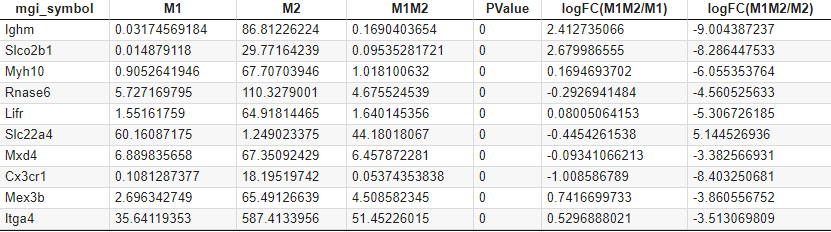
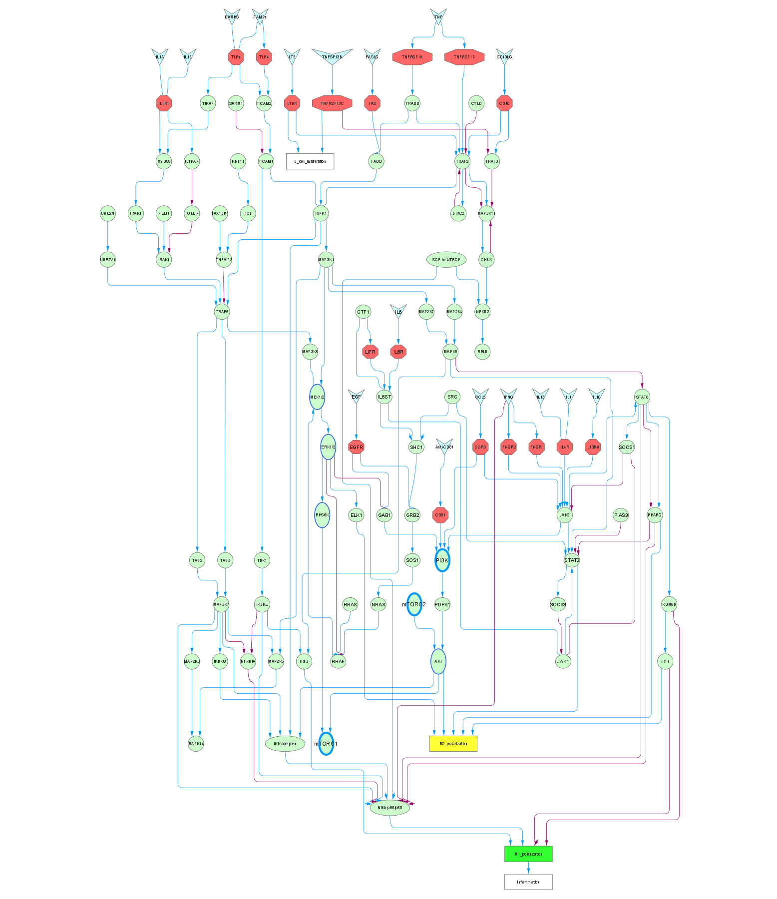
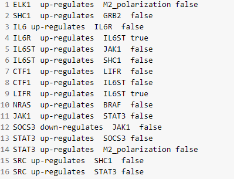
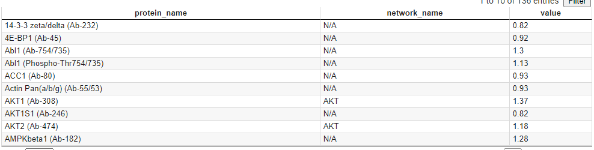

# What are the data files required for the analysis?
1. mRNA sequence data 
2. Network (pathways) file exported from Cytoscape 
3. Protein expression data

It would be best if you remembered before executing the script given by this tutorial that the naming convention for genes or protein in each data file is different.

For instance, the pathway obtained from the Cytoscape database, which depends on what database you refer to, sometimes has its particular naming convention to simplify such a complicated protein-protein interaction or signaling cascade.  

***We recommend the best practice to create a lookup table from each data based on the name of genes, proteins, or molecules as a reference library.***

It is also possible that each file may use different names for a specific target because of the synonym. 
Therefore, we recommend visiting [PDB website](https://www.rcsb.org/) to make sure you are not missing possible matches among genes, proteins, or molecules from these data files. 

## Structure of each Data File 

### 1. mRNA Sequence Data 

- Input file name: mRNAdata.csv 

How this data set was collected:
- The mRNA sequence data file contains the genes uniquely upregulated in M1 macrophage compared to M0 phenotype. 
This process was based on the [literature](https://www.frontiersin.org/articles/10.3389/fimmu.2019.01084/full) published in 2019.  

Description per Column:
1. MGI symbol: We refer this as gene name
2. mRNA seq Expression Level (rawdata) in M1 macrophage (the unit of RPM)
3. mRNA seq Expression Level (rawdata) in M2 macrophage (the unit of RPM)
4. mRNA seq Expression Level (rawdata) in M2 macrophage treated with M1 MEV (denoted as M1M2) (the unit of RPM)
5. P-value 
6. Log of Fold Change (base 2) between M1M2 and M1: positive means the up-regulated expression of target gene in M1M2
7. Log of Fold Change (base 2) between M1M2 and M2: positive means the up-regulated expression of target gene in M1M2

### 2. Network (Pathway) Exported from Cytoscape 

How this data set was collected: 

- Cytoscape provides an excellent toolkit for editing pathways, including merging networks, defining the characteristics of edges, adding or deleting nodes (edge denotes "protein-protein or signaling interaction" and node denotes "molecule or protein complex"). 

The demonstrated figure of the network, which is the outcome of merging multiple pathways for M1 and M2 polarization, can be exported as a sif file containing the information of protein-protein molecule-molecule interaction/signaling cascades in the text as shown in the below figure.  

- Input file name: expanded_IL6_modified_receptor.sif

How to interpret this text file:
- The fundamental structure of this data file is **A -> B**, which indicates directed network. 
- Directed network means that unless the text file indicates, the interaction is valid in one way as shown.

Description per Column:
1. Node names for the starting of the interaction between two proteins or molecules or complexes 
2. Edge characteristics 
3. Node names that is linked to the starting node
4. Boolean (true or false) to indicate whether the starting node is receptor or not. 

### 3. Protein Expression Data 

How this data set was collected:

- Input file name: Ab_chris.csv
- The data was experimentally collected to characterizae M1 and M2 macrophages. 
- Value in the 3rd column indicates the ratiomatric scale change in expression from M1 to M2. Therefore, below and above 1 indicate down-regulation and up-regulation respectively. 
- Because of name convension, there is an additional column (2nd) to list the node names that are equivalent to the protein names.

Description per Column:
1. Protein names reported via experiment 
2. Equivalent node names in Cytoscape-generated pathway
3. Ratiomatric value from M1 to M2 