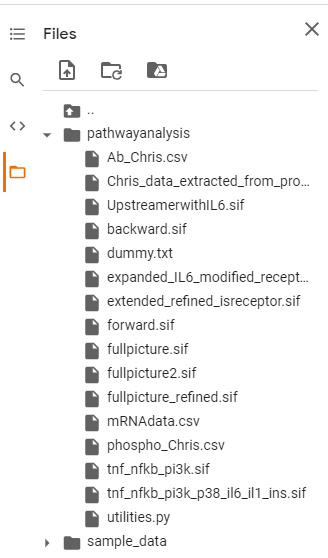
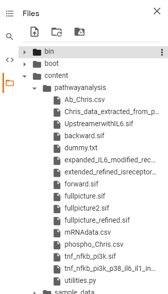

# What are the given data?
For the example, we have managed to provide three data sets for mRNA sequence expression, pathway network file generated by Cytoscape, and protein expression data obtained experimentally.

If you happen to update any of these data sets, we recommend to download the latest version of them. 
- Simple view

- Expanded view

To download files, simply right-click on mouse and click download files that need to be modified. 

For CSV file format, you can use google spreadsheet or excel to edit them and make sure save it as csv file. 

SIF file format is little bit tricky. Cytoscape may not provide or generate the same file format as we provide in this example. 
For instance, the fourth column of pathway file is not given by Cytoscape, meaning that it was manually assigned to indicate whether the starting node (the first column) is receptor or not. Plus, it is common that edge feature is as given in example. Thus, we recommand to scan through the pathway file (sif file) to modify the feature of edge (the second column). 
- spacing between neighboring columns is done by "tab" not "space bar"

To upload and execute the script, please make sure you upload the file by dragging and dropping in /content/pathwayanalysis or clicking upload button. 

